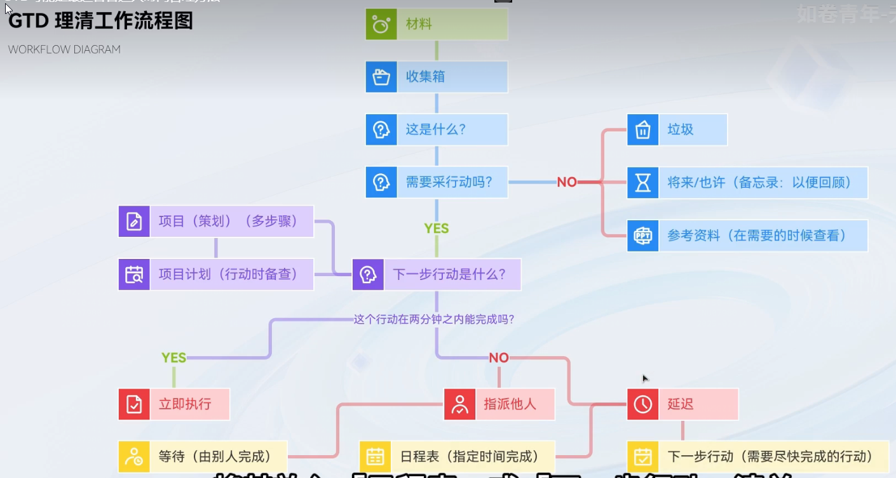

# 传统时间管理方法
从上到下

# GTD 方法论
get things done, 从小事开始.

顺序:
- 收集
	- 确保所有事情都被跟踪, 避免大脑一直在被耗损.
	- 强调灵感 & 优先级的重要性.
- 理清
	- 做一个决策树
	- 
- 组织
	- 把事项放入 清单 内
		- 项目清单
		- 项目的辅助资料
		- 日程表
		- 行动清单
		- 等待清单, 等别人完成的事项
		- 参考资料
		- 将来可能
- 回顾
	- 知识回顾
	- 事物回顾
		- 事前回顾
		- 事后回顾
- 行动
	- 时间 + 地点 完成事项
	- 四标准法: 有多少的 情境 + 时间 + 精力 + 重要性 来判断是否需要完成.

# GTD 实践

- [文件夹] 收集:
	- [文件夹] 任务
	- [文件夹] 信息
- [文件夹] 组织:
	- [文件夹] 事物列表
		- 基础信息: 
			- time: start time, end time, delay, complete
			- status: ing, wait, maybe, 2 retro, delay, complete, suspend
		- 任务资源
		- 更多信息
		- 项目信息
	- [文件夹] 日程表
	- [文件夹] 人际任务
- [文件夹] 行动:
	- 重要 & 紧急 4 象限
- [文件夹] 回顾: 日, 周, 月回顾